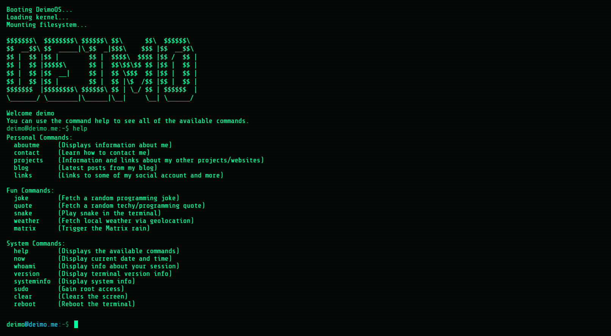

# DeimoOS — Terminal-Style Website

## About

DeimoOS is a front-end project built with **HTML, CSS, and JavaScript** that recreates the feel of a real terminal environment.

The focus is on **immersion and realism** from the block cursor and command history to smooth scrolling and animated screen clearing making it feel like you're interacting with an actual shell rather than a traditional website.

---

## Features

- 💻 Full-screen immersive terminal interface (no popups or overlays)
- 🎨 Clean, minimalist Unix-style UI with smooth animations + theme support (Default, Commodore 64, IBM, Dracula, Nord)
- 🔁 Immersive boot, reboot, and logoff sequences
- 🔊 Sound effects for boot, commands, and system events
- ⌨️ Realistic command-line input with blinking block cursor
- 🧠 Command history navigation (↑ / ↓) + tab autocomplete
- ⏹️ CTRL + C interrupt support for running tasks
- 📜 Auto-scrolling output with smooth clear-screen transitions
- 🧩 Rich command set (system, utility, fun, filesystem, and control commands)
- 📚 man pages + changelog command system
- 🖼️ Inline image rendering directly in the terminal
- 💾 Session-based file persistence (resets on reboot/logoff)
- 🧑 Persistent usernames with visit tracking
- 🕹️ Built-in Snake game with persistent leaderboard
- 🌐 Screensaver mode (Matrix rain) after inactivity
- ⚡ Lightweight vanilla JS architecture (no frameworks)

---

## Preview

---

## Available Commands

### Personal

| Command    | Description |
|------------|------------|
| `aboutme`  | Displays information about me |
| `contact`  | Learn how to contact me |
| `projects` | Information and links about my other projects/websites |
| `blog`     | Latest posts from my blog |
| `links`    | Links to some of my social accounts and more |

### Fun

| Command              | Description |
|----------------------|------------|
| `joke`              | Fetch a random programming joke |
| `quote`             | Fetch a random techy/programming quote |
| `matrix`            | Trigger Matrix rain effect |
| `snake`             | Play snake in the terminal |
| `snake-leaderboard` | Show the top 5 Snake scores |
| `themes`            | Show current theme and available options |
| `theme <name>`      | Switch the terminal color theme |
| `weather`           | Fetch local weather via geolocation |

### System

| Command          | Description |
|------------------|------------|
| `help`           | Displays the available commands |
| `man <command>`  | Show the manual page for a command |
| `changelog`      | Show the system changelog |
| `clear`          | Clears the terminal screen |
| `now`            | Display current date and time |
| `whoami`         | Display info about your session |
| `version`        | Display terminal version info |
| `systeminfo`     | Display system info |
| `sudo`           | Gain root access |
| `reboot`         | Reboot the terminal |
| `logout`         | Log out and return to login screen |

---
## Changelog

Access the full system update history here: [CHANGELOG.md](./CHANGELOG.md)

All notable changes to DeimoOS are recorded in this log.  
Entries are listed from newest to oldest version.

## Roadmap

### UI / UX Enhancements
- 🎨 Customizable themes (colors, fonts, cursor styles)  

### Fun Additions
- 🤖 Fake AI assistant command (`ai chat`)
- 🕹️ More minigames

---

## Tech Stack

- HTML5  
- CSS3  
- JavaScript

---

## License

This project is licensed under the MIT License — see the [LICENSE](LICENSE) file for details.